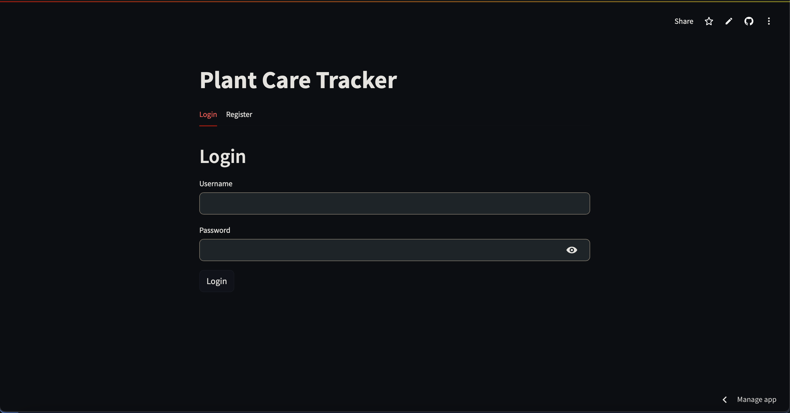
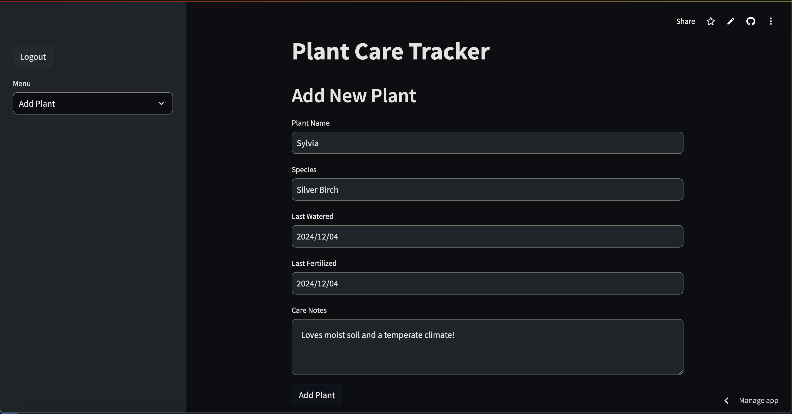
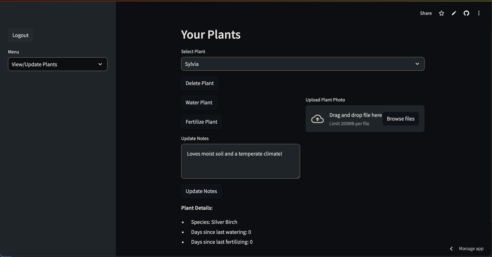
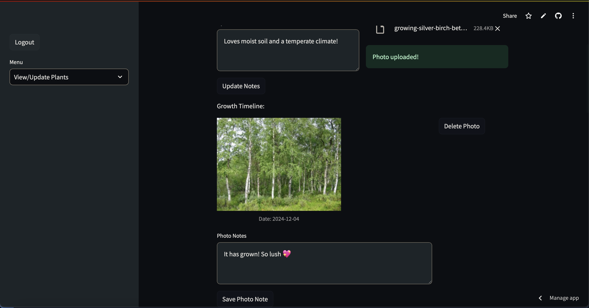

Welcome to Plant Tracker! Check it out [here](https://plant-tracker.streamlit.app).

Create an account or register for one. If you leave, you can always come back to check on your beloved plants!

Name your plant and state its species. Need someone else to take care of it or have so many that you forget how to? Write a care note to remember!

Select a plant to see when you last watered and/or fertilized your plants, and update it when you have done so. 

Feel free to upload photos of your plants growing, and add notes to each photo so that you remember each moment.

##### Known Errors

1. Adding a note to an image with photos under it may duplicate images under it.
2. Adding a note to a photo with images above it may overwrite the notes of images above it and under it.
3. Deleting a photo with images above it may delete the images above and under it.

Found more errors? Please create a PR!